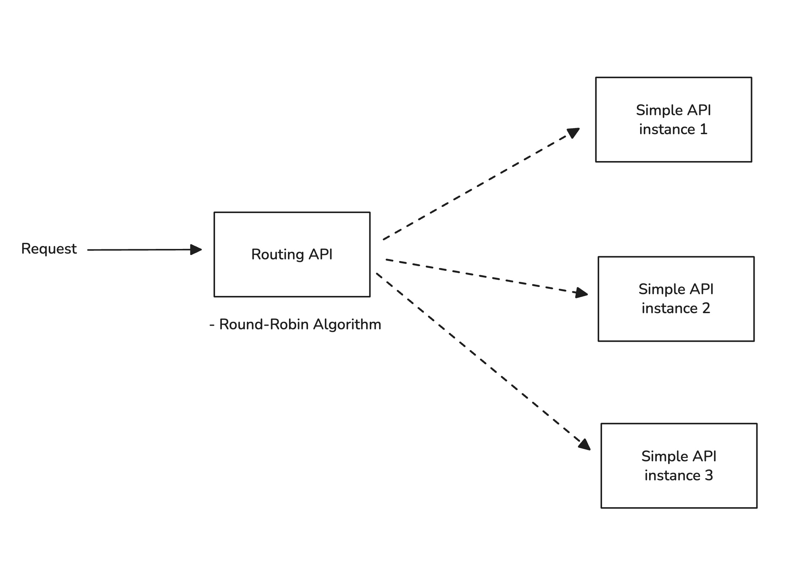

# POC - HTTP Round Robin API

## Architecture

This project implements a Round Robin Load Balancer with active health checking as per the assignment requirements:

- **Routing Service** - Round-robin load balancer
  - Including proactive monitoring upstream service
  - If stale health status table occur, using retry attempt with different host if one of the application APIs goes down
    - Preventing request to all hosts
- **Simple Echo Service** - Application API that echoes JSON requests

Note - Circuit breaker is feasible to be included as well. But I would like to minimize the implementation



## Routing Service (Load Balancer)

### Start Routing Service

```bash
# Terminal 1
./routing-service/mvnw -f routing-service/pom.xml spring-boot:run
```

**Configuration:**
- **Port**: 8080 (default)
- **Upstream hosts**: Configured via `CONFIG_DOWNSTREAM_HOSTS` environment variable
- **Health check interval**: 10 seconds
- **Failure attempt threshold**: 2
  - The threshold to preventing full iteration in host list

### Environment Variables

```bash
# Override default hosts
export CONFIG_DOWNSTREAM_HOSTS="http://localhost:8081/api/v1/echo,http://localhost:8082/api/v1/echo,http://localhost:8083/api/v1/echo"
```

### Test Load Balancer

```bash
# Test round-robin routing through load balancer
curl -X POST http://localhost:8080/lb/round-robin \
  -H "Content-Type: application/json" \
  -d '{"transactionId":"TXN123456","amount":350.00,"currency":"THB","merchantId":"MERCHANT_001"}'
```

## Simple API

In order to mock behavior of round-robin load balancer, need to simulate the environment to mock behavior.

### Start service

```bash
# Terminal 2
./simple-service/mvnw -f simple-service/pom.xml spring-boot:run -Dspring-boot.run.arguments=--server.port=8081

# Terminal 3  
./simple-service/mvnw -f simple-service/pom.xml spring-boot:run -Dspring-boot.run.arguments=--server.port=8082

# Terminal 4
./simple-service/mvnw -f simple-service/pom.xml spring-boot:run -Dspring-boot.run.arguments=--server.port=8083
```

### Test Echo Service Directly

```bash
curl -X POST http://localhost:8081/api/v1/echo \
  -H "Content-Type: application/json" \
  -d '{"transactionId":"TXN123456","amount":350.00,"currency":"THB","merchantId":"MERCHANT_001"}'
```