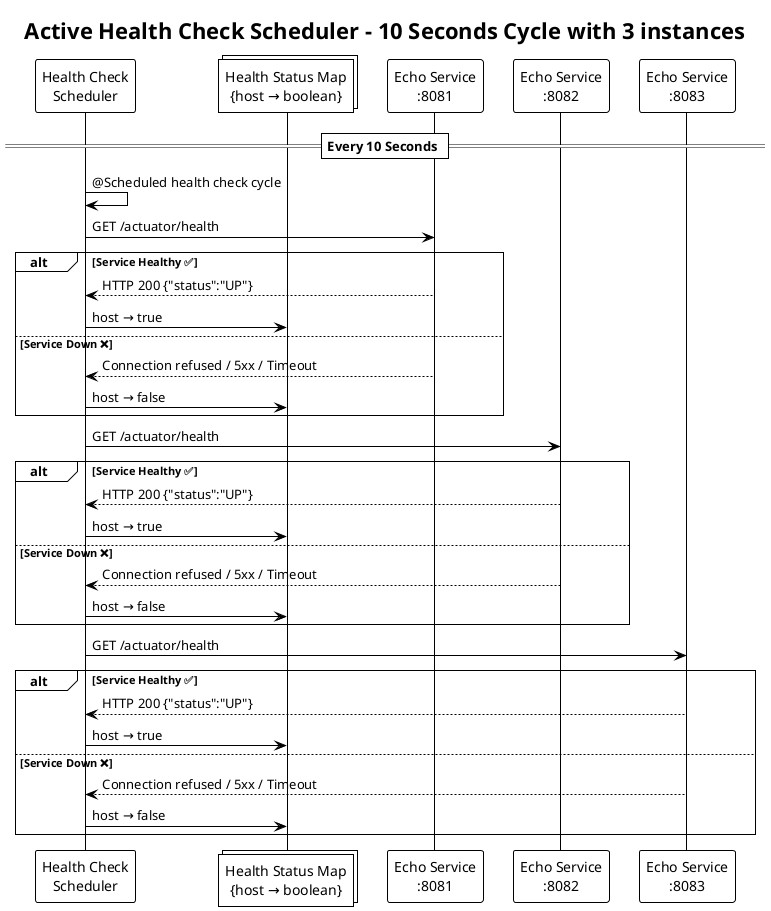

# POC - HTTP Round Robin API

## Architecture

This project implements a Round Robin Load Balancer:

- **Routing Service** - Round-robin load balancer
  - Including proactive health monitoring of upstream services
  - If stale health status occurs, uses retry attempts with different hosts when application APIs fail
    - Prevents requests to unhealthy hosts
  - Fixed timeout per request with failure attempt threshold
- **Simple Echo Service** - Application API that echoes JSON requests


## Architecture: Active Health Check System

The load balancer implements **proactive health monitoring** to detect service failures before they impact client requests:



### Key Benefits:
- **🚀 Fast failure detection**: Services marked unhealthy within 10 seconds of failure
- **⚡ Zero client impact**: Unhealthy hosts skipped immediately, no timeout delays
- **🔄 Automatic recovery**: Services automatically return to rotation when healthy
- **🧵 Thread-safe**: Concurrent health updates don't interfere with request routing
- **📊 Observable**: Comprehensive logging for monitoring and debugging

## Potential Improvements

While implementing this, I considered several enhancements but chose to focus on core functionality:

- **Circuit breaker pattern** - Could prevent calls to consistently failing services, but adds more complexity for POC scope
- **Timeout budget strategy** - Progressive timeout reduction (750ms total → 500ms first attempt → 250ms remaining) would improve UX under load, but standard fixed timeout + retry is simpler and sufficient for POC requirements

## Routing Service (Load Balancer)

### Start Routing Service

```bash
# Terminal 1
./routing-service/mvnw -f routing-service/pom.xml spring-boot:run
```

**Configuration:**
- **Port**: 8080 (default)
- **Upstream hosts**: Configured via `UPSTREAM_HOSTS` environment variable
- **Health check interval**: 10 seconds
- **Request timeout**: 500ms per attempt
- **Failure attempt threshold**: 2
  - Prevents full iteration through all hosts when requests are failing

### Environment Variables

```bash
# Override default hosts
export UPSTREAM_HOSTS="http://localhost:8081/api/v1/echo,http://localhost:8082/api/v1/echo,http://localhost:8083/api/v1/echo"

# Override default timeout (optional)
export UPSTREAM_TIMEOUT_MS="500ms"

# Override default failure threshold (optional)  
export UPSTREAM_FAILURE_ATTEMPT_THRESHOLD="2"
```

### Test Load Balancer

```bash
# Test round-robin routing through load balancer
curl -X POST http://localhost:8080/lb/round-robin \
  -H "Content-Type: application/json" \
  -d '{"transactionId":"TXN123456","amount":350.00,"currency":"THB","merchantId":"MERCHANT_001"}'
```

## Simple Echo Service

To test the round-robin load balancer, run multiple instances of the echo service on different ports.

### Start Echo Services

```bash
# Terminal 2 - Echo service on port 8081
./simple-service/mvnw -f simple-service/pom.xml spring-boot:run -Dspring-boot.run.arguments=--server.port=8081

# Terminal 3 - Echo service on port 8082  
./simple-service/mvnw -f simple-service/pom.xml spring-boot:run -Dspring-boot.run.arguments=--server.port=8082

# Terminal 4 - Echo service on port 8083
./simple-service/mvnw -f simple-service/pom.xml spring-boot:run -Dspring-boot.run.arguments=--server.port=8083
```

### Test Echo Service Directly

```bash
curl -X POST http://localhost:8081/api/v1/echo \
  -H "Content-Type: application/json" \
  -d '{"transactionId":"TXN123456","amount":350.00,"currency":"THB","merchantId":"MERCHANT_001"}'
```